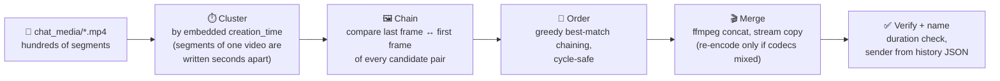

# 📼 snapreconstruct

**Reassemble the long videos that Snapchat's data export chops into pieces.**

[](https://www.python.org/)
[](https://ffmpeg.org/)
[](LICENSE)
[]()

When you download your data from Snapchat ([accounts.snapchat.com](https://accounts.snapchat.com) → *My Data*), every video longer than ~10 seconds arrives in `chat_media/` shredded into anonymous 10-second segment files — with **no metadata telling you which segments belong together or in what order**. A 50-second video becomes five files with unrelated random names, mixed in with hundreds of others.

`snapreconstruct` puts them back together, losslessly, with one command.

```console
$ python3 snapreconstruct.py mydata~1786999390670

▶ Probing mydata~1786999390670/chat_media
  reading metadata ██████████████████████████ 332/332 100%
  done in 11.2s
  332 videos, 86 same-time clusters to examine

▶ Detecting segments (boundary-frame matching)
  comparing frames ██████████████████████████ 293/293 100%
  done in 58.4s
  291 segments form 85 split videos; 2 same-burst files are distinct videos

▶ Stitching 85 videos
  stitching ██████████████████████████ 85/85 100%
  done in 33.0s

▶ Renaming + copying 41 single-segment videos
  renaming + copying ██████████████████████████ 41/41 100%
  done in 0.1s

────────────────────────────────────────────────────────
✔ 85 videos reconstructed from 291 segments (42.9 min of footage)
✔ 41 single videos renamed + copied
✔ senders: bestfriend, myusername
• 2 burst files kept separate (same send time, different videos)
→ merged_videos
```

Live progress bars show the current file and an ETA; output degrades gracefully to plain log lines when piped or redirected.

---

## ✨ Features

- 🧩 **Automatic segment detection** — no manual sorting through hundreds of files
- 🖼️ **Correct ordering via computer vision** — segments are chained by matching the last frame of one against the first frame of the next
- 🔒 **Lossless by default** — merges use ffmpeg stream copy: zero re-encoding, zero quality loss
- 🎞️ **Handles Snapchat's quirks** — normalizes shuffled audio/video track order, and re-encodes only the rare video whose segments mix h264 + HEVC
- 🏷️ **Readable filenames with sender attribution** — `2025-11-16_20-42-53_username_4parts.mp4`, matched against your `snap_history.json` / `chat_history.json`
- 📚 **Complete output** — videos that were never split are copied in too (named `..._1part.mp4`), so the output folder holds every video with one consistent naming scheme (`--merged-only` to skip)
- 🧾 **Audit trail** — a `merge_report.json` maps every output back to its source segments
- ✅ **Self-verifying** — every merge is checked against the expected total duration
- 🕵️ **100% local & private** — your media never leaves your machine; originals are never modified

## 📦 Requirements

- Python 3.8+ (standard library only — `requirements.txt` exists for tooling but is intentionally empty)
- [ffmpeg / ffprobe](https://ffmpeg.org/download.html) on your `PATH`

## 🚀 Usage

```bash
python3 snapreconstruct.py [export_dir] [-o OUTPUT_DIR]
```

**No arguments needed** — run it bare and your system's folder picker opens to choose the export folder, then the output folder (Cancel on the output picker uses the default). Dialogs are tried in order: tkinter, zenity/kdialog (Linux), `choose folder` (macOS), FolderBrowserDialog (Windows), then a terminal prompt.

`export_dir` is your unzipped Snapchat export — the folder that contains `chat_media/` (and ideally `json/snap_history.json` + `json/chat_history.json`, used only to label who sent each video). Pointing at `chat_media` itself, or at a folder containing exactly one export, also works.

| Option | Default | Meaning |
|---|---|---|
| `export_dir` | folder picker | The unzipped export to process |
| `-o`, `--output` | folder picker, Cancel = `<export_dir>/../merged_videos` | Where merged videos and the report are written |
| `--merged-only` | off | Only write stitched videos; don't copy the single-segment ones into the output |

Merged files keep the original recording timestamp both in their mp4 metadata (`creation_time`) and file modification time, so they sort correctly in any gallery app.

## 🔬 How it works



1. **Cluster** — `ffprobe` reads each mp4's embedded `creation_time`. Segments of one video are encoded back-to-back when it's sent, so they land within a few seconds of each other. Files created within 5 s on the same day form a candidate cluster.
2. **Chain** — creation time alone can't order segments (they're written near-simultaneously), and clusters can also contain *several* videos sent in one burst. So the tool extracts a 64×64 grayscale thumbnail of the **first and last frame** of every file and compares them pairwise. A true continuation matches the previous segment's final frame almost pixel-perfectly (mean difference typically < 5 on a 0–255 scale, up to ~25 with fast motion), while unrelated videos score 36+. That gap makes chaining unambiguous: pairs under the threshold of 30 are linked greedily, cycle-safe, each file getting at most one predecessor and one successor.
3. **Merge** — each chain is concatenated with ffmpeg's concat demuxer using `-c copy` (bit-for-bit lossless). Two Snapchat gotchas are handled:
   - some segments are muxed audio-track-first, others video-track-first — track order is normalized before concat, otherwise the output is silently corrupted;
   - occasionally one video's segments mix h264 and HEVC, which can't share an mp4 track — only these chains are re-encoded (x264 CRF 18).
4. **Verify & name** — every output's duration must match the sum of its parts within 0.5 s. Files are named `<timestamp>_<sender>_<Nparts>.mp4`; the sender is the author of the closest video/media event (within 120 s) in your export's history JSON.

## 📊 Output

```
merged_videos/
├── 2025-11-16_20-38-28_bestfriend_3parts.mp4
├── 2025-11-16_20-42-53_bestfriend_4parts.mp4
├── 2026-02-28_04-11-53_myusername_2parts.mp4
├── 2026-03-02_19-15-40_bestfriend_1part.mp4
└── merge_report.json
```

`_Nparts` files are stitched; `_1part` files are byte-identical copies of videos that were never split, renamed so the whole folder shares one scheme.

`merge_report.json`:

```json
{
 "merged": [
  {
   "output": "2025-11-16_20-42-53_bestfriend_4parts.mp4",
   "sender": "bestfriend",
   "duration": 39.31,
   "parts": ["2025-11-16_b~EiAS...mp4", "..."]
  }
 ],
 "singles": [
  {
   "output": "2026-03-02_19-15-40_bestfriend_1part.mp4",
   "sender": "bestfriend",
   "duration": 7.9,
   "parts": ["2026-03-02_b~EiAS...mp4"]
  }
 ],
 "errors": [],
 "standalone_in_bursts": ["files that shared a send-time but are separate videos"]
}
```

- **`singles`** — the never-split videos copied into the output (omitted with `--merged-only`).
- **`standalone_in_bursts`** — files that sat in the same time cluster but whose frames don't connect: several distinct videos sent in one message. They're still included in the output as `_1part` copies.
- The tool only creates new files and never modifies your export.

## ⚠️ Limitations

- Ordering relies on visual continuity at segment boundaries. A hard scene cut *exactly* on a 10-second boundary of a single recording could break a chain (in practice Snapchat segments are cut mid-recording, so boundaries always connect).
- Sender attribution needs the export's `json/` folder; without it, files are named with `unknown`.
- Only `.mp4` files in `chat_media/` are considered; images and overlay files are ignored.

## 📄 License

[MIT](LICENSE)

---

*Built because 10 seconds was never enough.*
